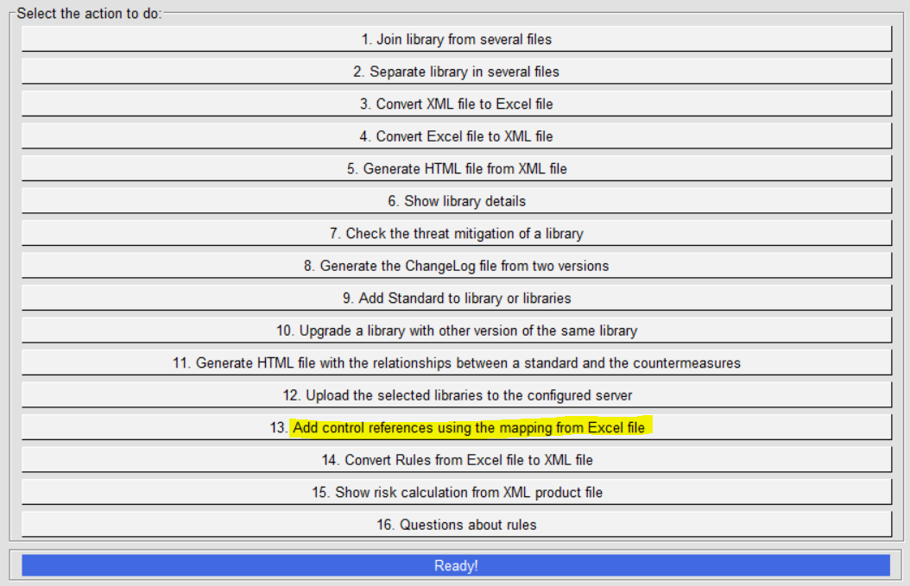
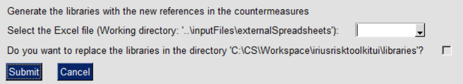
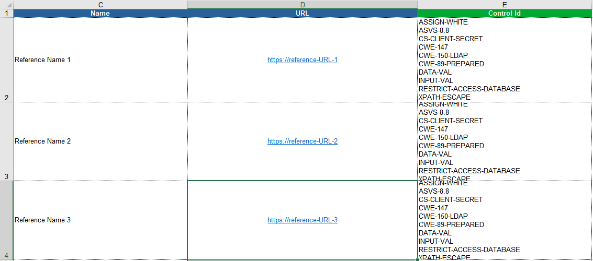
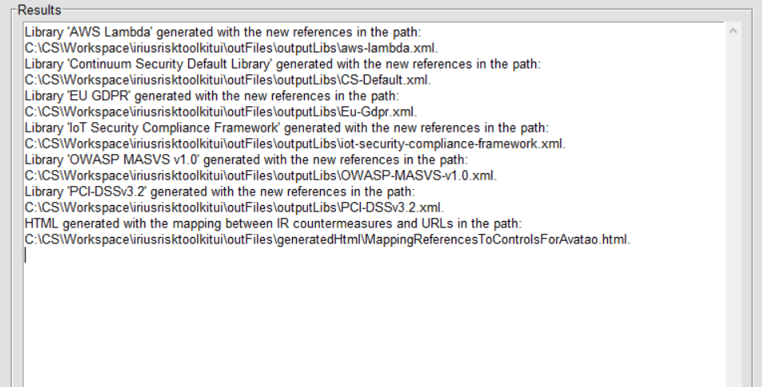

IriusRisk Toolkit UI : Add control references using the mapping from Excel file
======================================================================================================

Launch IriusRiskToolkitUI by executing the following command:

``` 
python IriusRiskToolKitUI.py
```

This will open a GUI. Among them is the option "Add control references
using the mapping from Excel file":



This option adds references to controls from an excel spreadsheet:



Excel mappings between URL references and countermeasures are stored in
inputFiles/externalSpreadsheets and the columns structure is shown
below:



If the replace checkbox is checked results will be exported in the
libraries folder. Otherwise, they will be exported in
outFiles/outputLibs:


