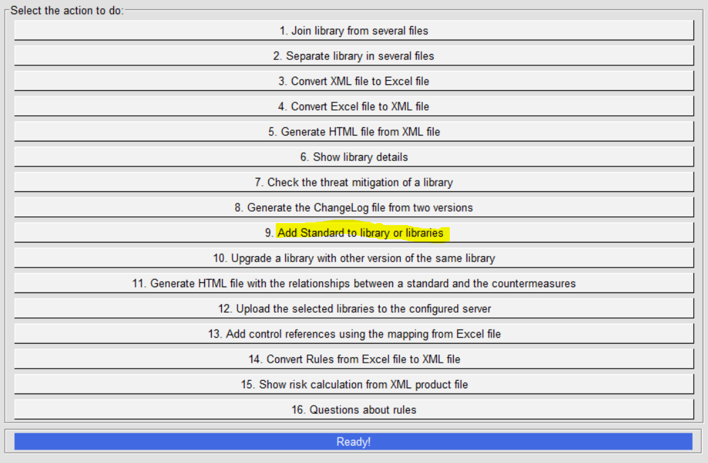
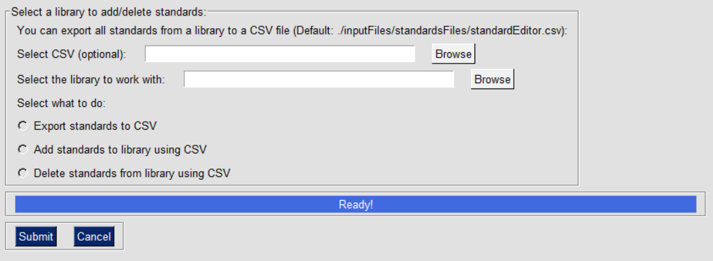
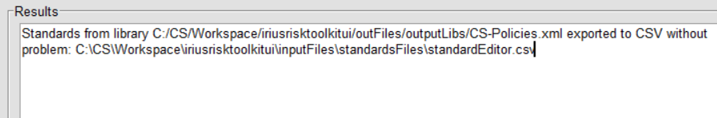

IriusRisk Toolkit UI : Add standard to libraries
=======================================================================    
 
Launch IriusRiskToolkitUI by executing the following command:  
  
``` 
python IriusRiskToolKitUI.py
```

This will open a GUI. Among them is the option "Add Standard to library
or libraries":



This option has three possible choices:

* Export standards to CSV: A CSV file composed by five columns (Component, Control, Supported Standard Name, Supported Standard Ref, Standard Ref) will be created in inputFiles/standardsFiles/standardEditor.csv, except if you indicate a different file with the “Select CSV” browse option.
* Add standards to library using CSV: Once the exported CSV has been modified leaving only those controls that need a standard this file will be used to modify the selected library.
* Delete standards to library using CSV: Same as before, but removing the standards from the controls listed in the CSV file.

The library to work with must be selected using the browse button:



Depending of the selected choice the result will be a message indicating where are the files saved:



Suppose that a subset of countermeasures from a library must apply a certain new standard called X. First of all an export should be done using the first option. After that the CSV is ready to be modified in Excel/Libreoffice/Other tools. The information given by the export process can help to quickly identify and mark those countermeasures that must apply standard X. Once the file is complete the second option could be used to output a new modified library containing this new standard. If something went wrong during the process and that standard needs to be removed the third opcion could be used to do the reverse process, removing the new standard from all those modified countermeasures.

[Back to index](Readme.md)