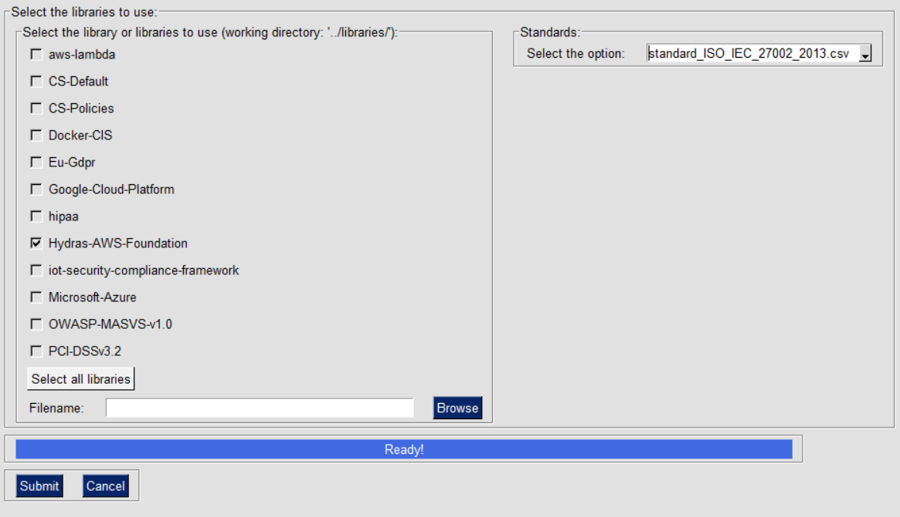
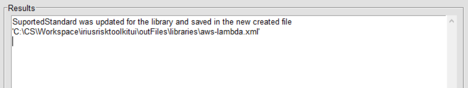

IriusRisk Toolkit UI : Add standard to libraries
=======================================================================    
 
Launch IriusRiskToolkitUI by executing the following command:  
  
``` 
python IriusRiskToolKitUI.py
```

This will open a GUI. Among them is the option "Add Standard to library
or libraries":


This option will add or update standards defined in component’s controls
based on standards defined as CSV files in inputFiles/standardsFiles.

If the library is already in the iriusrisktoolkit/libraries directory it
will appear automatically with a checkbox. Otherwise it can be selected
from the "browse" option:



If there are no errors the result will be saved in outFiles/libraries
folder and the following message will be displayed:


