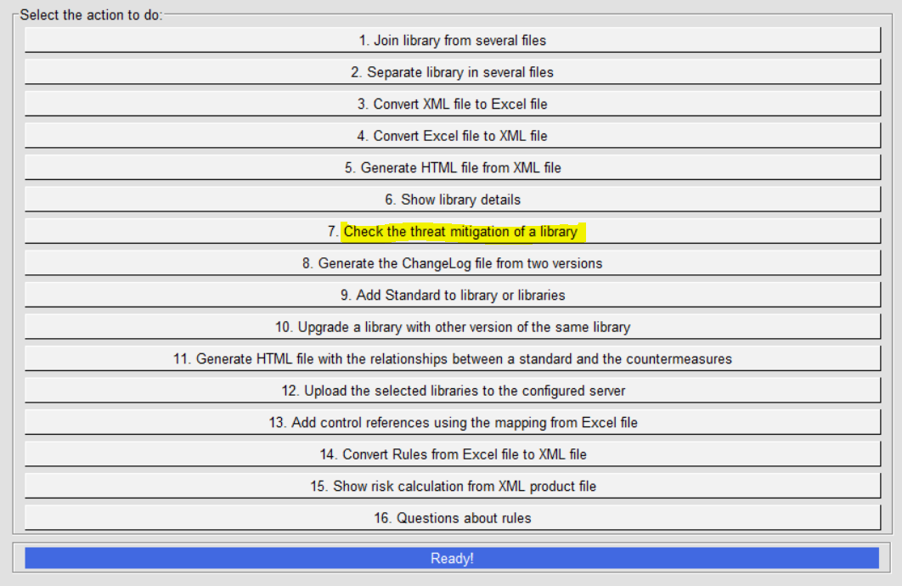
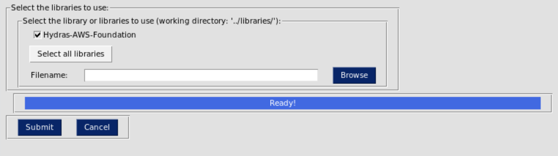
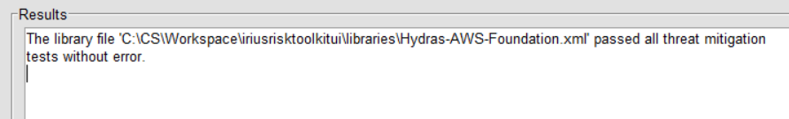

IriusRisk Toolkit UI : Check the threat mitigation of a library
======================================================================================

Launch IriusRiskToolkitUI by executing the following command:

```
python IriusRiskToolKitUI.py
```

This will open a GUI. Among them is the option "Check the threat
mitigation of a library":



If the library is already in the iriusrisktoolkit/libraries directory it
will appear automatically with a checkbox. Otherwise it can be selected
from the "browse" option:



If there are no errors with the mitigation values in the library the
following message will appear:



[Back to index](Readme.md)
