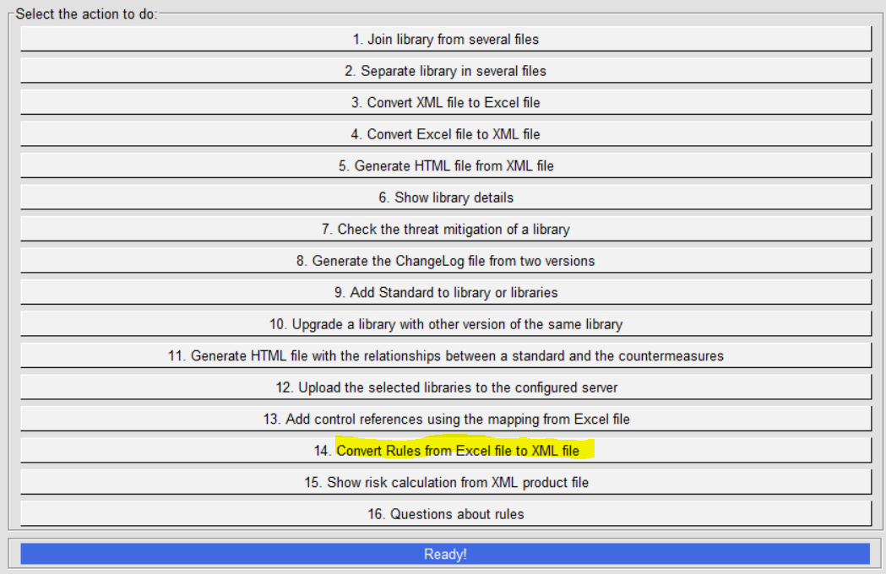
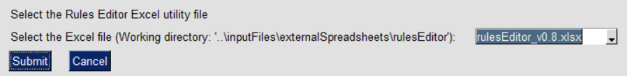
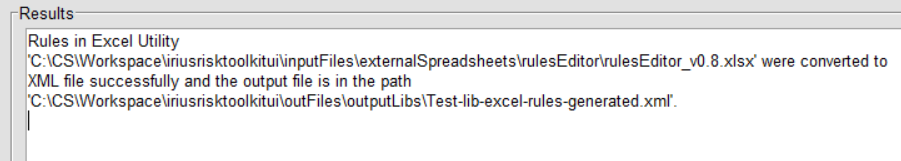

IriusRisk Toolkit UI : Convert rules from Excel to XML
=============================================================================    

Launch IriusRiskToolkitUI by executing the following command:    

``` 
python IriusRiskToolKitUI.py
```    

This will open a GUI. Among them is the option "Convert Rules from Excel
file to XML file":



With this option a library will be created with only rules definitions
defined by the Rules Editor spreadsheet located in
inputFiles/externalSpreadsheets/rulesEditor:



If there are no errors the following message will be displayed:


    

[Back to index](Readme.md)