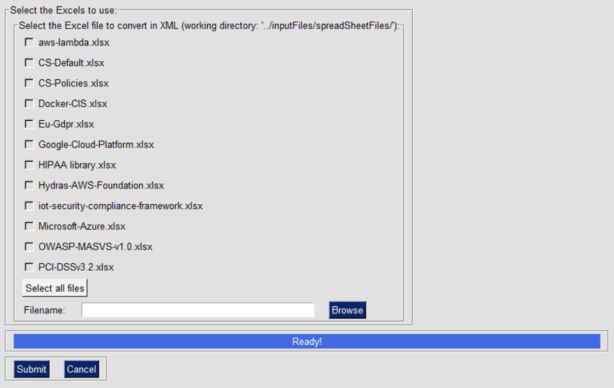

IriusRisk Toolkit UI : Export Library XLSX to XML
================================================================    

Launch IriusRiskToolkitUI by executing the following command:    

```
python IriusRiskToolKitUI.py
```

This will open a GUI. Among them is the option "Convert library Excel file to
XML file":


If the library to be exported is already in the
iriusrisktoolkit/inputFiles/spreadSheetFiles directory it will appear
automatically with a checkbox. Otherwise it can be selected from the
"browse" option:



After a couple of seconds the result will be exported in
iriusrisktoolkit/outFiles/outputLibs directory:

    

[Back to index](Readme.md)