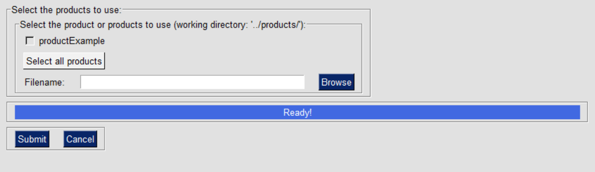
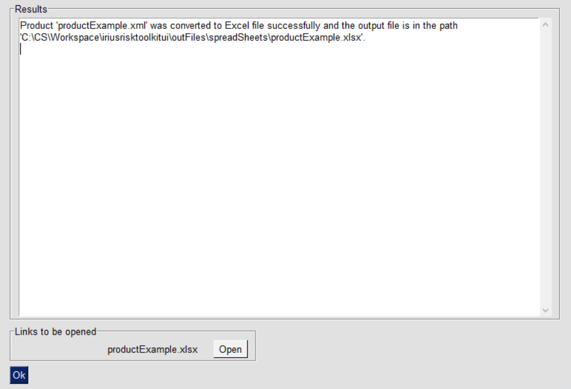
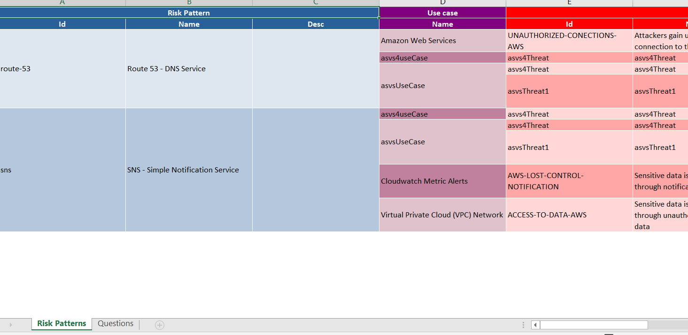

IriusRisk Toolkit UI : Export Product XML to XLSX
================================================================    

Launch IriusRiskToolkitUI by executing the following command:    

``` 
python IriusRiskToolKitUI.py
```    

This will open a GUI. Among them is the option "Convert Product XML file to
Excel file":


If the product to be exported is already in the
iriusrisktoolkit/products directory it will appear automatically with a
checkbox. Otherwise it can be selected from the "browse" option:



After a couple of seconds the result will be exported in
iriusrisktoolkit/outFiles/spreadSheet directory:



    

[Back to index](Readme.md)