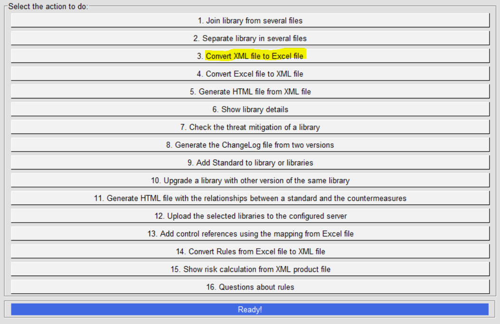
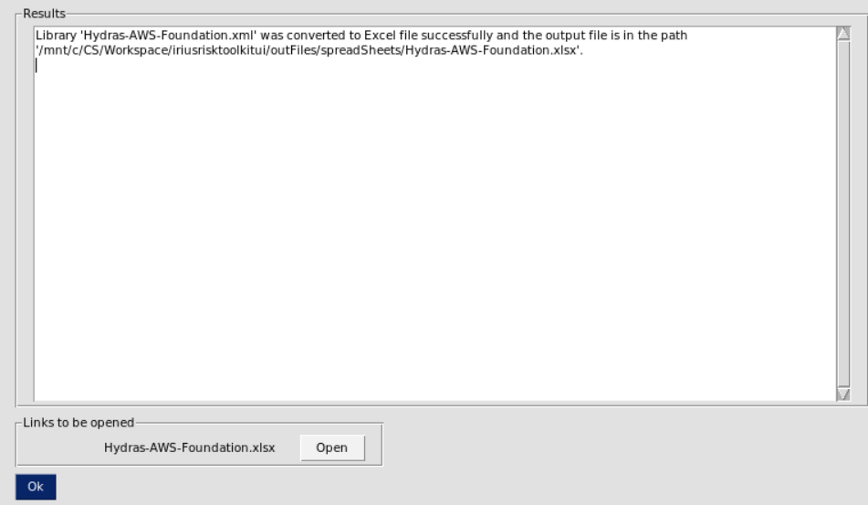
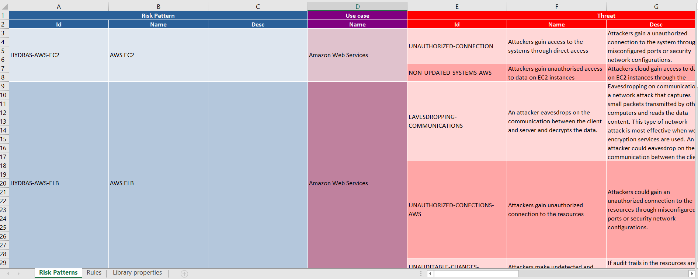

IriusRisk Toolkit UI : Export XML to XLSX
================================================================    

Launch IriusRiskToolkitUI by executing the following command:    

``` 
python IriusRiskToolKitUI.py
```    

This will open a GUI. Among them is the option "Convert XML file to
Excel file":



If the library to be exported is already in the
iriusrisktoolkit/libraries directory it will appear automatically with a
checkbox. Otherwise it can be selected from the "browse" option:


After a couple of seconds the result will be exported in
iriusrisktoolkit/outFiles/spreadSheet directory:



    
