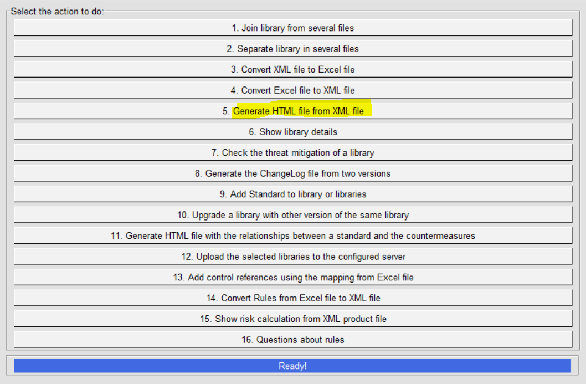
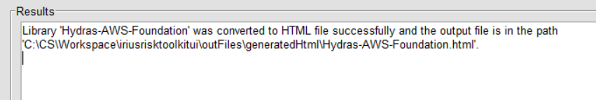
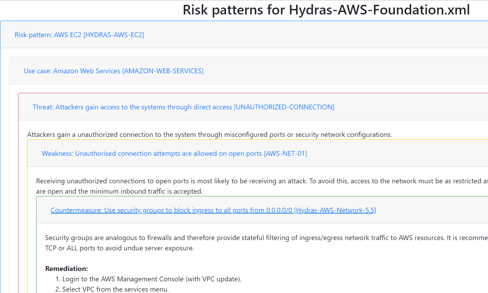

IriusRisk Toolkit UI : Generate HTML library report
==========================================================================    

Launch IriusRiskToolkitUI by executing the following command:    

``` 
python IriusRiskToolKitUI.py
```    

This will open a GUI. Among them is the option "Generate HTML file from
XML file":



If the library to be exported is already in the
iriusrisktoolkit/libraries directory it will appear automatically with a
checkbox. Otherwise it can be selected from the "browse" option:


After a couple of seconds the result will be exported in
iriusrisktoolkit/outFiles/generatedHtml directory:



HTML report will show all risk patterns, use cases, threats, weaknesses
and controls for a library:

    

[Back to index](Readme.md)