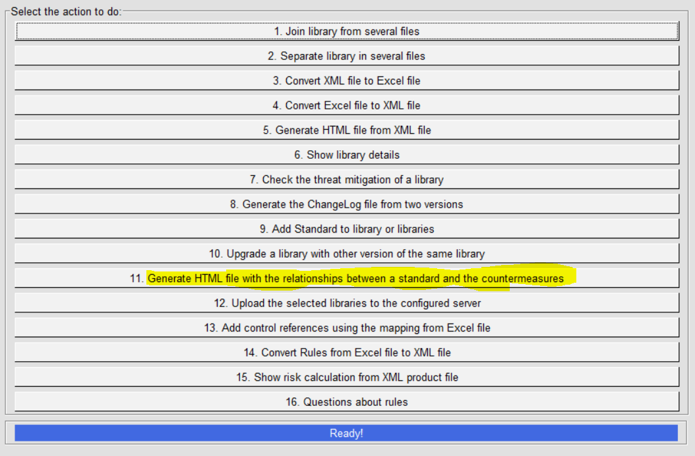
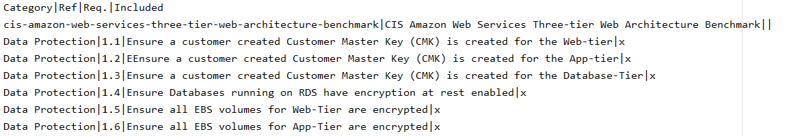
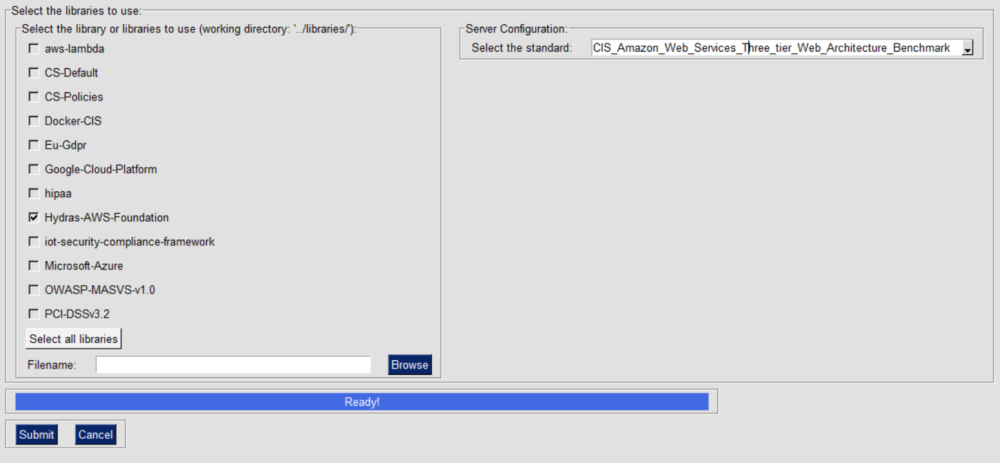
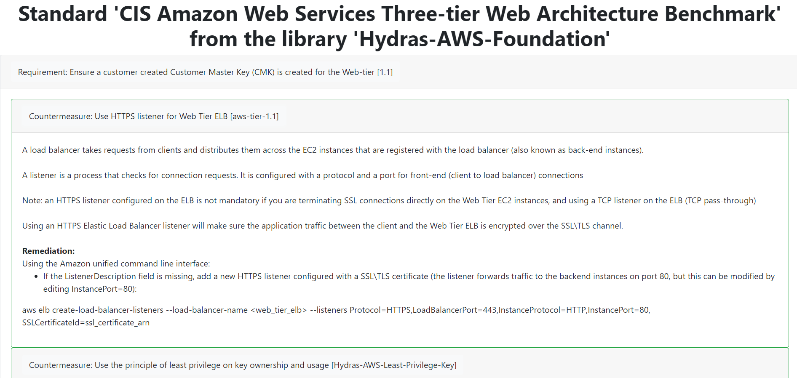

IriusRisk Toolkit UI : Generate HTML report with relationships between standards and countermeasures
===========================================================================================================================    

Launch IriusRiskToolkitUI by executing the following command:    

``` 
python IriusRiskToolKitUI.py
```    

This will open a GUI. Among them is the option "Generate HTML file with
the relationships between a standard and the countermeasures":



This option will generate a report showing all countermeasures in the library that checks the selected standard. Standards are defined as CSV files in inputFiles/descriptionOfStandards folder. Every file must be called "standard_<name of the standard>.csv" and it must fit the following format:

``` 
Category|Ref|Req.|Included
``` 

The Second line must be:

``` 
StandardRef|StandardName
``` 
An example csv file is shown in the image below:


If the library is already in the iriusrisktoolkit/libraries directory it
will appear automatically with a checkbox. Otherwise it can be selected
from the "browse" option.



An HTML report will show all countermeasures related with the selected
standard:

    
