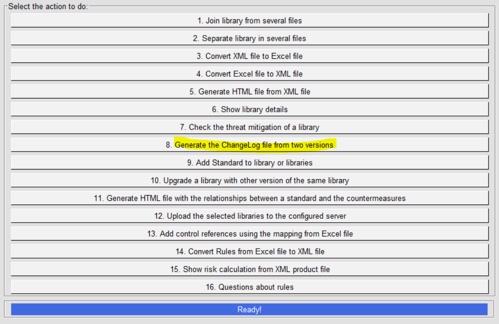
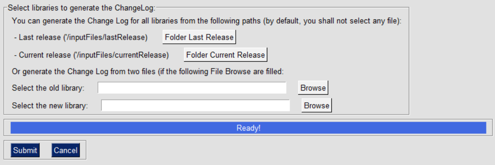
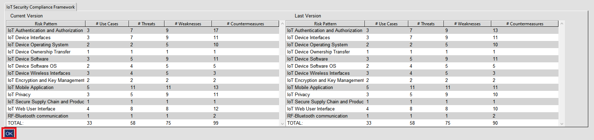
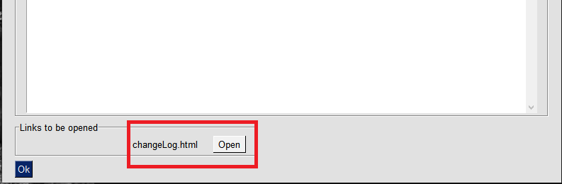
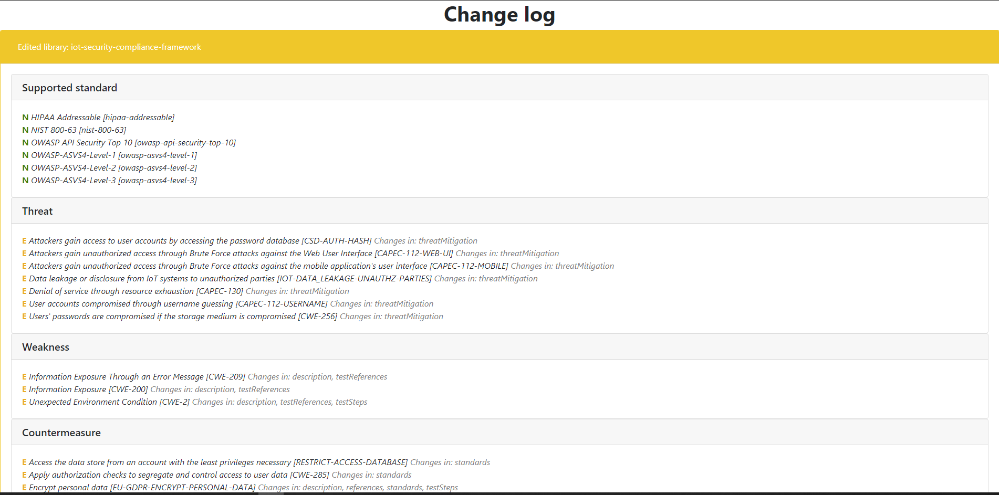

IriusRisk Toolkit UI : Generate changelog file from two versions
=======================================================================================    

Launch IriusRiskToolkitUI by executing the following command:    

``` 
python IriusRiskToolKitUI.py
```    

This will open a GUI. Among them is the option "Generate the ChangeLog
file from two versions":



This will generate a comparison between two versions of the same
library. You need to move the libraries to the inputFiles/lastRelease
and inputFiles/currentRelease in order to submit directly, or you can
select folders/libraries to compare:



If there are any changes in the number of use cases, threats, weaknesses
or countermeasures a comparison between both versions will appear side
to side:



If you click on the "OK" button another window will appear:



Here you’ll be able to see an HTML report with the differences between
the involved libraries:

    
