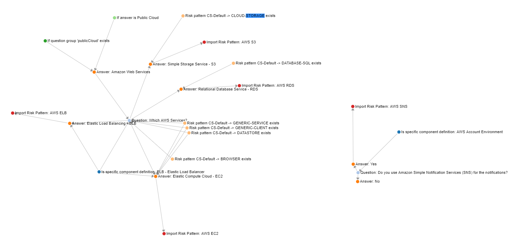
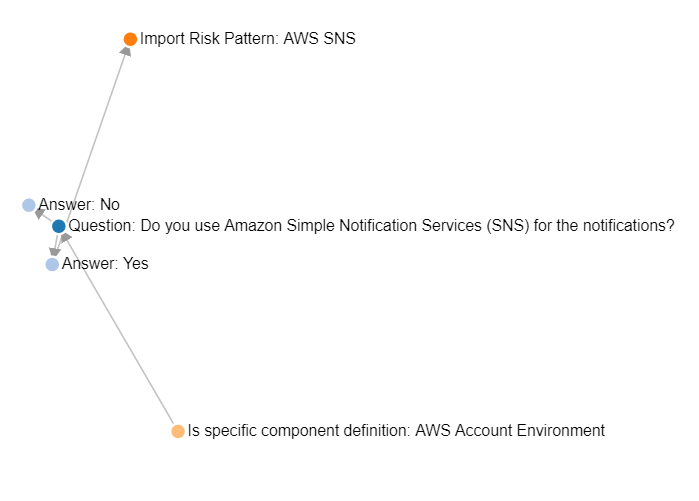

IriusRisk Toolkit UI : Generate rules graph
==================================================================

In order to see the relationships between the rules in a library we made
a tool to show them in a graph. This will start up a Flash server (in
127.0.0.0:8000 by default) where the graph will be displayed.

\***Important**: if you run this program several times changing the
arguments you must reload the web page by pressing Ctrl+F5 to force
browser's cache deletion (other browsers may have another methods to
clean cache storage). If this is not done the graph may not be updated
after usage.

There are two ways to generate the graph:

-   Generating all relationships:

``` 
python src/generateRulesGraph.py <name_of_the_library>.xml
```

This will show the complete graph for the library:


-   Generate the graph based on a certain node:

``` 
python src/generateRulesGraph.py <name_of_the_library>.xml <element_reference> <depth>
```

For example,
`python src/generateRulesGraph.py Hydras-AWS-Foundation.xml aws.sns.yes 2`
will show only a graph where nodes are related to the "aws.sns.yes" node
with a rule depth of 2 (that means the number of iterations the program
will do in order to search rules related to the node and relatives):



[Back to index](Readme.md)

