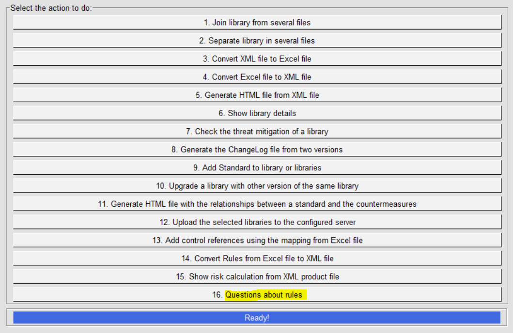
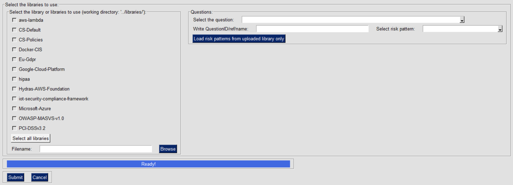

IriusRisk Toolkit UI : Questions about rules
===================================================================    

Launch IriusRiskToolkitUI by executing the following command:    

``` 
python IriusRiskToolKitUI.py
```    

This will open a GUI. Among them is the option "Questions about rules":



This option will generate an HTML report with the rules and components
that answers a question from the group of selectable questions.

If the library is already in the iriusrisktoolkit/libraries directory it
will appear automatically with a checkbox. Otherwise it can be selected
from the "browse" option:



Some of this questions may ask for parameters.

-   If the question needs a reference it can be written in the input box

-   If the question is related to a risk pattern, it can be selected
    from the selectable box

-   If the library is not loaded automatically because it is outside the
    libraries folder you can click the "Load risk patterns from uploaded
    library only" button **after** selecting the library with the Browse
    button.

Results will be generated in outFiles/generatedHtml folder:

    

[Back to index](Readme.md)