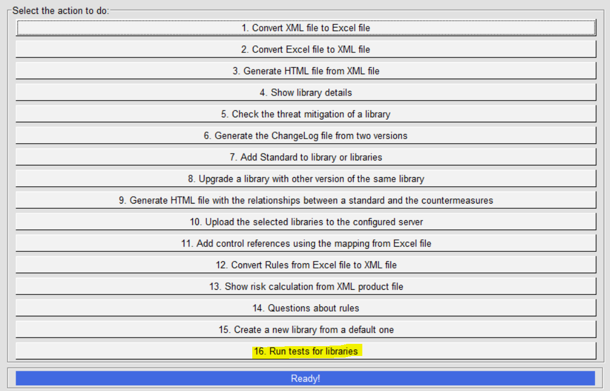
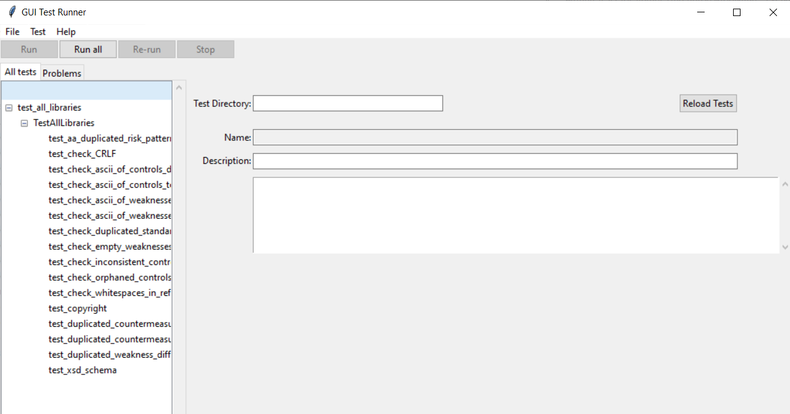
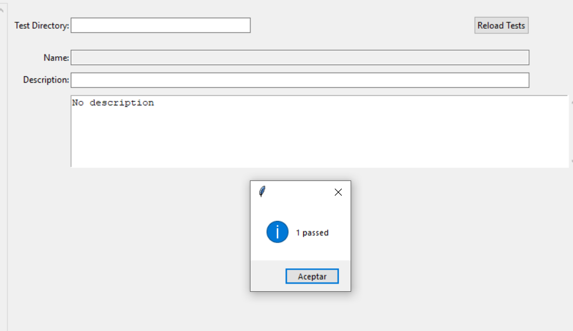

IriusRisk Toolkit UI : Run tests for libraries
===================================================================    

Launch IriusRiskToolkitUI by executing the following command:    

``` 
python IriusRiskToolKitUI.py
```    

This will open a GUI. Among them is the option "Run tests for libraries":



This option will open a Pytest-GUI window in which you can select a python test from folder /src/tests/libraries.



By default you will see common tests that are ready to be tested on all libraries in folder /libraries, but you can deploy your own tests following the same unittest suite definition as given.

You can run one single test or run all tests. After a test is finished a message will appear indicating if any errors occurred.

 

[Back to index](Readme.md)