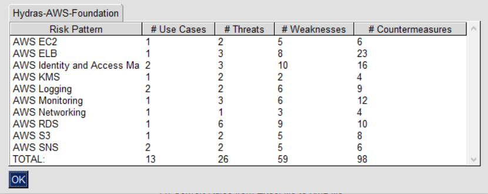

IriusRisk Toolkit UI : Show library details
==================================================================    

Launch IriusRiskToolkitUI by executing the following command:    

``` 
python IriusRiskToolKitUI.py
```    

This will open a GUI. Among them is the option "Show library details":


If the library is already in the iriusrisktoolkit/libraries directory it
will appear automatically with a checkbox. Otherwise it can be selected
from the "browse" option:


Results will show how many use cases, threats, weaknesses and
countermeasures has the selected libraries:

    

[Back to index](Readme.md)