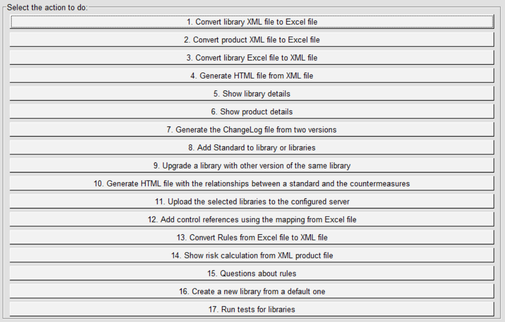
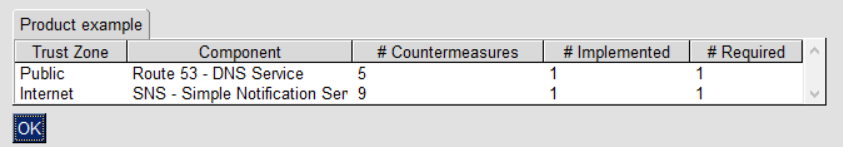

IriusRisk Toolkit UI : Show product details
==================================================================    

Launch IriusRiskToolkitUI by executing the following command:    

``` 
python IriusRiskToolKitUI.py
```    

This will open a GUI. Among them is the option "Show product details":



If the product is already in the iriusrisktoolkit/products directory it
will appear automatically with a checkbox. Otherwise it can be selected
from the "browse" option:


Results will show how many countermeasures are in every component and which are required or implemented:

    

[Back to index](Readme.md)