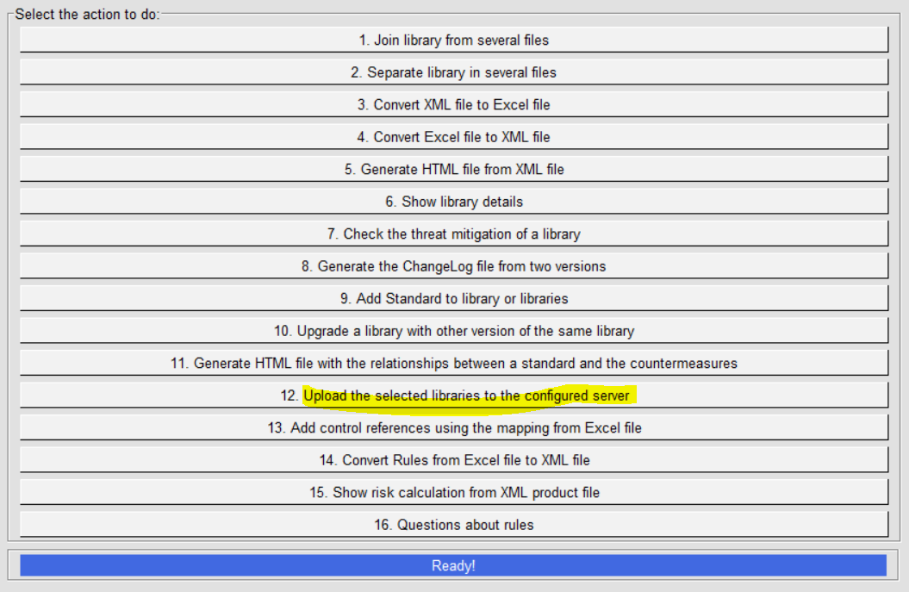
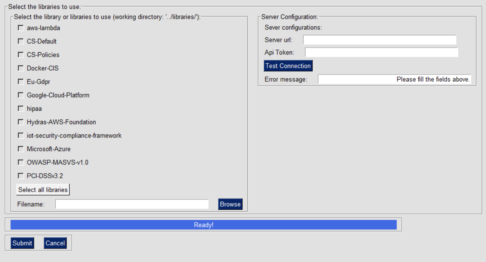
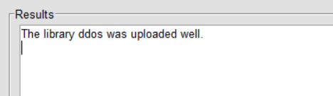

IriusRisk Toolkit UI : Upload libraries to a configured server
=====================================================================================    

Launch IriusRiskToolkitUI by executing the following command:    

``` 
python IriusRiskToolKitUI.py
```    

This will open a GUI. Among them is the option "Upload the selected
libraries to the configured server":



This option will upload a library to the configured IriusRisk server.
First of all server configuration must be filled with host URL and an
API token from a user with permissions. You can check the connectivity
by clicking the "Test Connection" button.

If the library is already in the iriusrisktoolkit/libraries directory it
will appear automatically with a checkbox. Otherwise it can be selected
from the "browse" option:



If there are no errors with the connectivity or the library the
following message will appear (in this case "ddos" was the library
name):

    
